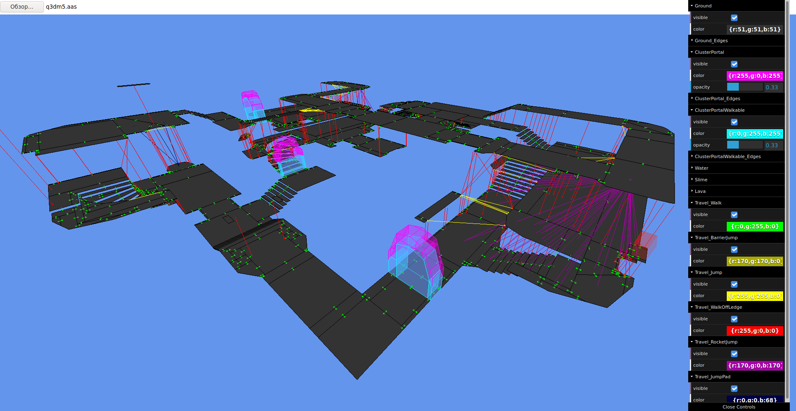
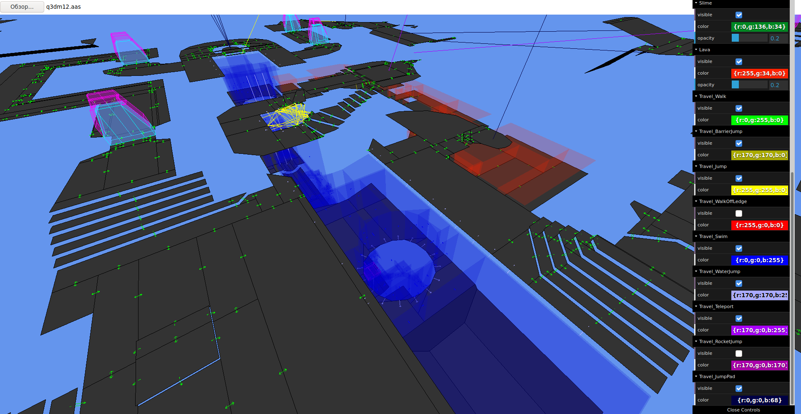

# AAS Bot Navigation Viewer

This tool allows you to view navigation meshes and data stored in AAS files
generated by [bspc](https://github.com/TTimo/bspc) (mostly used in Quake 3 and
derived games).

It can be used for map development to troubleshoot bot navigation issues,
and to aid in understanding of how AAS-based pathfinding works.

[Click here to open the viewer](https://razer-rbi.github.io/aas-playground/)



If you are a developer or modder, you can find more information about the
Quake 3 bot AI and pathfinding in the
[original paper](https://www.researchgate.net/publication/240430519_The_Quake_III_Arena_Bot).

## Features
Versions 5 and 4 are supported.

* Reachability display grouped by type (shown as colored arrows)
* Ground and liquid face display
* Cluster portal rendering
* Editable colors and opacity, toggleable visibility



## Quake 2 support
If you want to generate AAS for a Quake 2 map, you can try out my
[bspc fork](https://github.com/RaZeR-RBI/bspc) which adds support for
Quake 2's collision model for reachability calculation.

## Development
Clone, install dependencies and run a dev server:
```sh
npm install
npm run dev
```
